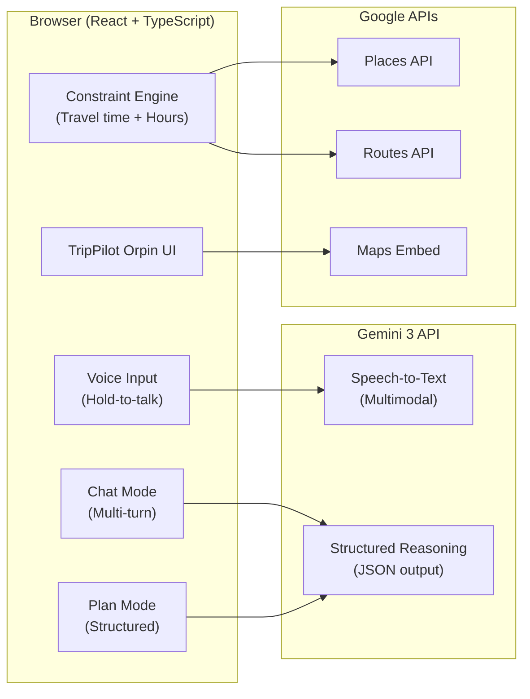

# TripPilot Orpin — Gemini 3 Hackathon Submission

> **AI-powered travel planning that actually works.** Turn messy travel ideas into executable, constraint-aware itineraries using Gemini 3's multimodal and structured reasoning capabilities.

[](https://trippilot-orpin.vercel.app)
[](https://ai.google.dev/)

---

## The Problem

Planning a multi-stop trip sounds simple, but real-world constraints make it surprisingly hard:

- **Opening hours**: That museum closes at 5 PM
- **Travel time**: 30 minutes between stops adds up
- **Limited daylight**: You can't fit 10 attractions into one day

Most travel apps ignore these constraints. You end up with a "plan" that falls apart the moment you start walking.

## Our Solution: TripPilot Orpin

TripPilot Orpin combines **deterministic constraint checking** with **Gemini 3's reasoning capabilities** to create plans that actually work.

### How Gemini 3 Powers TripPilot Orpin

| Capability                | Gemini 3 Feature Used      | What It Does                                           |
| ------------------------- | -------------------------- | ------------------------------------------------------ |
| **Voice Input**           | Multimodal API (audio)     | Hold-to-talk: speak your travel ideas naturally        |
| **Place Recommendations** | Structured JSON output     | Returns places with categories, durations, and reasons |
| **Constraint Detection**  | JSON schema enforcement    | Identifies timing conflicts and impossible schedules   |
| **Smart Fixes**           | Chain-of-thought reasoning | Proposes actionable solutions (reorder, reduce stay)   |
| **Multi-turn Chat**       | Context-aware conversation | Refine plans through natural dialogue                  |

---

## Key Features

### 1. Multimodal Voice Input

Hold the mic button and speak naturally. Gemini 3 transcribes your voice and understands travel intent.

```
"I want to visit the Colosseum, Roman Forum, and Pantheon today"
→ Gemini extracts: 3 places, Rome, 1 day, historical preference
```

### 2. Structured Plan Generation

Paste rough notes → Get a structured itinerary. Not chat text — real JSON with:

- Place names and search queries
- Category tags (Historic, Landmark, Museum...)
- Recommended duration
- **Why this place** (recommendation reason)

### 3. Constraint-Aware Optimization

The app checks your plan against real-world constraints:

- ✅ Opening hours (via Google Places API)
- ✅ Travel time between stops
- ✅ Total time vs. available daylight

When conflicts are detected, Gemini 3 reasons through the problem:

```json
{
  "thought": "Pantheon closes at 19:00. Current arrival 20:15 is invalid.",
  "action": "reorder",
  "details": { "move": "Pantheon", "to_position": 1 }
}
```

### 4. One-Click Export

- **Google Maps**: Open your route with turn-by-turn navigation
- **Google Calendar**: Add your itinerary as calendar events

---

## Architecture



---

## Gemini 3 Integration Details

### 1. Speech-to-Text (Multimodal)

```typescript
// trippilot/services/gemini/speechToText.ts
const response = await callGemini({
  contents: [
    {
      parts: [
        { inlineData: { mimeType: "audio/webm", data: audioBase64 } },
        { text: "Transcribe this audio..." },
      ],
    },
  ],
});
```

### 2. Structured Itinerary Generation

```typescript
// Gemini returns strict JSON, not free-form text
{
  "days": [{
    "day": 1,
    "title": "Ancient Rome",
    "items": [{
      "label": "Colosseum",
      "query": "Colosseum Rome Italy",
      "category": "Historic site",
      "durationMinutes": 180,
      "reason": "Iconic amphitheater, best visited early to avoid crowds"
    }]
  }]
}
```

### 3. Constraint Detection & Resolution

```typescript
// trippilot/services/aiOrchestrator.ts
// Step 1: Normalize app state to constraint snapshot
// Step 2: Gemini detects violations (JSON schema)
// Step 3: Gemini proposes fixes (actionable JSON)
// Step 4: App auto-applies the fix
```

---

## Tech Stack

- **Frontend**: React 18, TypeScript, Vite, Tailwind CSS
- **AI**: Gemini 3 API (via Vercel serverless proxy for security)
- **Maps**: Google Maps Platform (Places, Routes, Maps Embed)
- **Backend**: Firebase (Auth, Firestore) for saving/sharing trips
- **Deployment**: Vercel

---

## Run Locally

### Prerequisites

- Node.js 18+
- Google Cloud API keys (Gemini, Maps)

### Setup

```bash
# Clone and install
git clone <your-repo-url>
cd trippilot
npm install

# Configure environment
cp .env.example .env.local
# Edit .env.local:
# VITE_GEMINI_API_KEY=your_gemini_key
# VITE_GOOGLE_MAPS_API_KEY=your_maps_key

# Run development server
npm run dev
# Opens http://localhost:5173
```

---

## Demo

- **Live App**: [trippilot-orpin.vercel.app](https://trippilot-orpin.vercel.app)
- **Video Demo**: [3-minute walkthrough](link-to-video)

### Demo Workflow

1. **Voice/Text Input**: Speak or type your travel ideas
2. **Review Recommendations**: See places with reasons
3. **Add to Trip**: Click to add places to your itinerary
4. **Check Constraints**: Red warnings show conflicts
5. **AI Optimize**: One click to fix with Gemini 3
6. **Export**: Open in Google Maps or add to Calendar

---

## What Makes TripPilot Orpin Different

| Traditional Travel Apps | TripPilot Orpin                  |
| ----------------------- | -------------------------------- |
| Lists of places         | **Constraint-aware schedules**   |
| Free-form chat          | **Structured, actionable JSON**  |
| Manual planning         | **AI-powered optimization**      |
| Copy-paste workflows    | **One-click Google integration** |

---

## Challenges We Overcame

1. **Making AI Actionable**: Free-form text isn't executable. We forced Gemini to return strict JSON schemas that the app can parse and apply.

2. **Secure API Access**: Browser-side API keys are dangerous. We built a Vercel serverless proxy to keep Gemini API keys server-side.

3. **Voice UX**: Click-to-record felt clunky. Our "hold-to-talk" interaction feels natural, like a walkie-talkie.

4. **Constraint Complexity**: Balancing travel time, opening hours, and user preferences required a dedicated scoring system.

---

## What's Next

- **Weather-aware Planning**: Swap outdoor activities on rainy days
- **Personalization**: Learn user preferences over time
- **Collaborative Trips**: Real-time multi-user editing
- **Offline Support**: Download plans for travel without connectivity

---

## Team

Built for the Gemini 3 Hackathon by passionate travelers who hate impossible itineraries.

---

## License

MIT — see [LICENSE](LICENSE)
