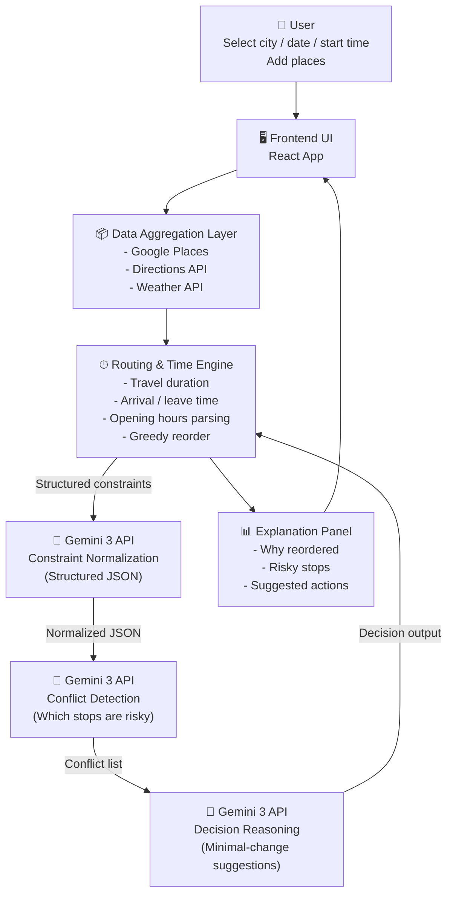

# Architecture Notes

## 1) Deterministic vs Probabilistic

- 地图、时间、距离 → 确定性系统（Deterministic）
- 决策、取舍、冲突 → Gemini 推理（Probabilistic reasoning）

## 2) Gemini 的职责边界

- Gemini 不直接生成 itinerary（行程表）。
- Gemini 基于结构化约束做推理与决策建议。

## 3) Multi-step API Calls

不是一次 prompt 完成，而是多步调用，逐层收敛：

1. 约束标准化（Constraint Normalization）
2. 冲突识别（Conflict Detection）
3. 决策与最小改动建议（Decision + Minimal-change suggestions）

## 4) Model-in-the-loop

- Gemini 的输出会回流到系统计算流程（Routing & Time Engine），而不是只用于展示。

## 5) Structured Input / Output

- Input：JSON constraints
- Output：JSON decisions
- 尽量避免非结构化自然语言 prompt 作为唯一接口

## 6) Explainability（可解释性）

每个 AI 决策都应包含：

- 原因（Reason）
- 证据（Evidence）
- 影响（Impact）
